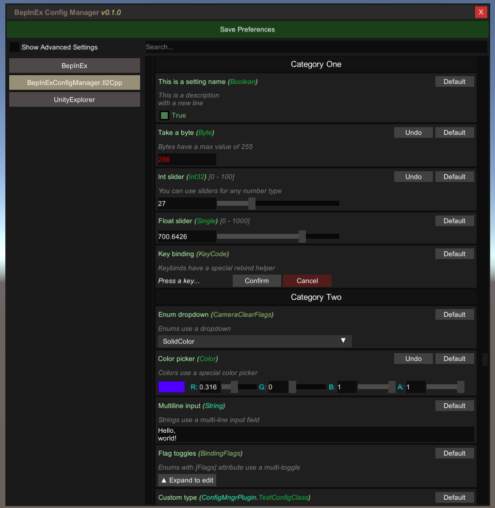

# BepInExConfigManager.Il2Cpp

In-game UI for managing BepInEx Configurations in IL2CPP.

Requires BepInEx 6+.

## Releases [](../../releases/latest)

* [Download (IL2CPP)](https://github.com/sinai-dev/BepInExConfigManager/releases/latest/download/BepInExConfigManager.Il2Cpp.zip)

## How to use

* Put the DLL in your `BepInEx\plugins\` folder.
* Start the game and press `F5` to open the Menu.
* You can change the keybinding under the `BepInExConfigManager.Il2Cpp` category in the Menu, or by editing the file `BepInEx\config\com.sinai.bepinexconfigmanager.il2cpp.cfg`.

[](https://raw.githubusercontent.com/sinai-dev/BepInExConfigManager/master/img/preview.png)

## Info for developers

The UI supports the following types by default:

* Toggle: `bool`
* Number input: `int`, `float` etc (any primitive number type)
* String input: `string`
* Key binder: `UnityEngine.KeyCode` or `UnityEngine.InputSystem.Key`
* Dropdown: `enum`
* Multi-toggle: `enum` with `[Flags]` attribute
* Color picker: `UnityEngine.Color`
* Struct editor: `UnityEngine.Vector3`, `UnityEngine.Quaternion`, etc
* Toml input: Anything else with a corresponding Mapper registered to `BepInEx.Configuration.TomlTypeConverter`.

To make a slider, use a number type and provide an `AcceptableValueRange` when creating the entry. For example:
```csharp
Config.Bind(new ConfigDefinition("Section", "Int slider"), 32, new ConfigDescription("You can use sliders for any number type",
        new AcceptableValueRange<int>(0, 100))); 
```

You can override the Toml input for a Type by registering your own InteractiveValue for it. Refer to [existing classes](https://github.com/sinai-dev/BepInExConfigManager/tree/main/src/UI/InteractiveValues) for more concrete examples.
```csharp
// Define an InteractiveValue class to handle 'Something'
public class InteractiveSomething : InteractiveValue
{
    // declaring this ctor is required
    public InteractiveSomething(object value, Type fallbackType) : base(value, fallbackType) { }

    // you could also check "if type == typeof(Something)" to be more strict
    public override bool SupportsType(Type type) => typeof(Something).IsAssignableFrom(type);

    // override other methods as necessary
}

// Register your class in your BasePlugin.Load method:
public class MyMod : BepInEx.IL2CPP.BasePlugin
{
    public override void Load()
    {
        InteractiveValue.RegisterIValueType<InteractiveSomething>();
    }
}
```

## Todo

* Add support for `AcceptableValueList`
* Handle "Advanced" settings and other attributes / tags
